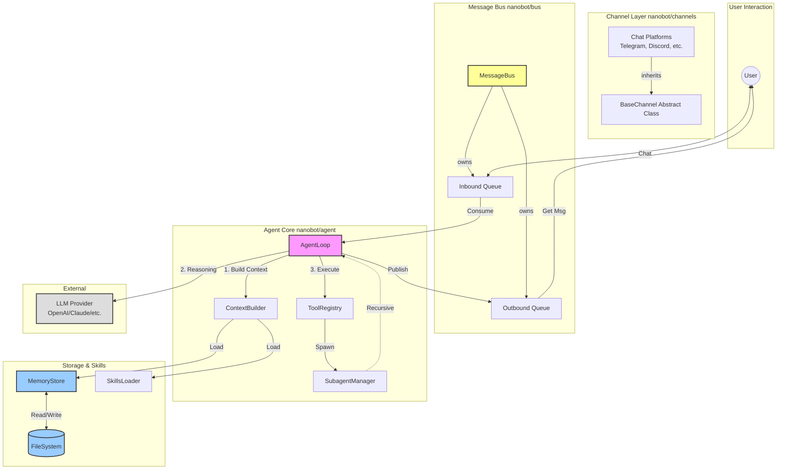
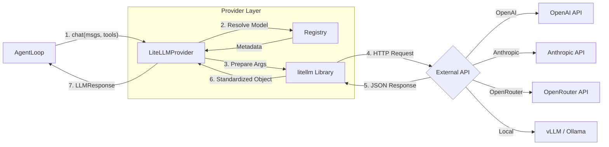
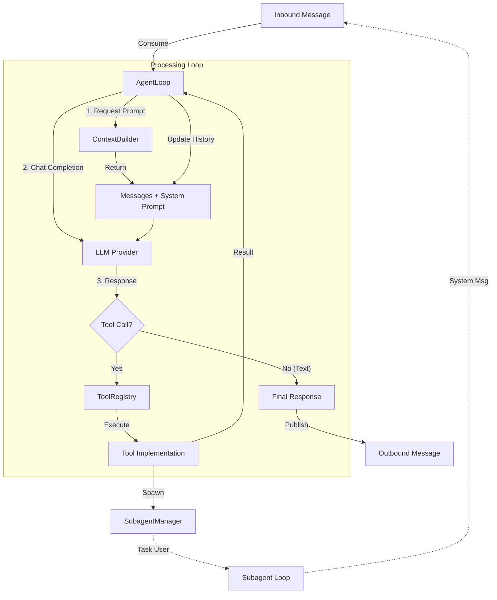
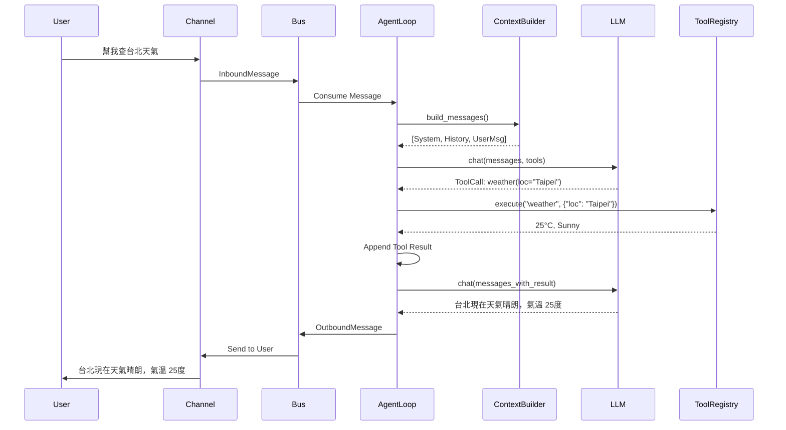

# nanobot 架構說明

## 架構概觀

Nanobot 採用極輕量級的設計，其核心由 Agent 主迴圈 (Loop)、訊息匯流排 (Bus)、與通道層 (Channels) 組成。



## 架構說明

### 1. Message Bus (訊息匯流排)

系統的中樞神經，實現了 Agent 核心與具體聊天平台的解耦。

- **Inbound Queue (輸入佇列)**: 接收來自所有通道的訊息，按順序傳遞給 Agent。
- **Outbound Queue (輸出佇列)**: 存放 Agent 處理後的的回覆，Bus 會將其分發回對應的通道。

### 3. Agent Core (核心層)

負責主要的邏輯處理、思考與決策。

- **AgentLoop**: 核心主迴圈，負責協調感知、思考與行動的過程。
- **ContextBuilder**: 負責組裝提示詞 (Prompt)，包含長期記憶、當前技能與對話歷史。
- **ToolRegistry**: 管理所有可用的工具 (Tools)，如檔案操作、Google 搜尋等。
- **SubagentManager**: 負責產生與管理子 Agent，用於處理複雜或長時間運行的背景任務。

### 4. Storage & Skills (儲存與技能)

- **MemoryStore**: 管理長期記憶與對話歷史，儲存於檔案系統 (JSON/Markdown 格式)。
- **SkillsLoader**: 動態載入技能定義，讓 Agent 能夠根據需求擴充能力。

### 5. External (外部服務)

- **LLM Provider**: 透過統一介面 (LiteLLM) 呼叫各家 AI 模型 (OpenAI, Anthropic, DeepSeek 等)，不依賴特定供應商。

---

## 核心組件詳解 (Agent Components)

本節詳細說明 `nanobot/agent` 內部的核心組件及其運作邏輯。

### 1. AgentLoop (`nanobot.agent.loop`)

Agent 的主控制器，負責協調「感知 -> 思考 -> 行動」的循環。

- **職責**:
  - 從 `MessageBus` 接收訊息。
  - 管理對話 Session 與記憶整合 (Memory Consolidation)。
  - 呼叫 `ContextBuilder` 構建 Prompt。
  - 呼叫 LLM 進行推理。
  - 處理 LLM 的工具呼叫 (Tool Calls) 並透過 `ToolRegistry` 執行。
  - 將最終回應送回 `MessageBus`。
- **關鍵邏輯**:
  - **Inner Loop**: 在單次對話回合中，如果 LLM 決定使用工具，`AgentLoop` 會執行工具並將結果回傳給 LLM，直到 LLM 決定生成最終回覆或達到最大迭代次數 (Max Iterations)。
  - **System Messages**: 定期檢查子 Agent (Subagent) 的完成通知。

### 2. ContextBuilder (`nanobot.agent.context`)

負責將各種上下文資訊組裝成 LLM 看得懂的 Prompt。

- **職責**:
  - **System Prompt**: 包含 Agent 身分定義 (IDENTITY.md)、核心規則 (AGENTS.md)、長期記憶 (Memory) 與可用技能 (Skills) 的摘要。
  - **Message History**: 轉換對話歷史格式，並處理多媒體內容 (如圖片轉 Base64)。
  - **Prompt Loading**: 透過 `PromptLoader` 從 `CONTEXT.md` 讀取模板，實現 Prompt 與程式碼分離。
- **關鍵邏輯**:
  - **Skill Loading**: 根據設定動態載入技能內容，避免 Prompt Token 過長。
  - **Prompt Template**: 使用 `# ===[Title]===` 格式在 `CONTEXT.md` 中管理所有 System Prompts，支援變數動態替換。

### 3. ToolRegistry (`nanobot.agent.tools.registry`)

工具的註冊與執行中心。

- **職責**:
  - 儲存所有可用工具 (如 `ReadFileTool`, `WebSearchTool`)。
  - 生成 OpenAI Function Calling 格式的 Schema (`get_definitions`)。
  - 驗證參數並執行工具 (`execute`)。
- **關鍵邏輯**:
  - 提供統一的介面讓 AgentLoop 呼叫，無需關心個別工具的實作細節。

### 4. SubagentManager (`nanobot.agent.subagent`)

負責背景任務的執行與管理。

- **職責**:
  - **Spawn**: 產生一個輕量級的 Agent 實例來處理特定任務。
  - **Isolation**: 子 Agent 擁有獨立的 Context 和 System Prompt，專注於單一任務。
  - **Reporting**: 任務完成後，透過 `system` 通道將結果匯報給主 Agent。
- **關鍵邏輯**:
  - 子 Agent 為了安全與簡化，通常被限制無法使用 `message` (發送訊息) 或 `spawn` (產生子 Agent) 工具。

---

## LLM 通訊機制 (LLM Communication)

本節說明 `nanobot/agent` 如何與外部 LLM 進行通訊，以及所使用的第三方函式庫。

### 1. 核心函式庫: LiteLLM

Nanobot 並不直接使用各家廠商 (OpenAI, Anthropic) 提供的 SDK，而是全面採用 **[LiteLLM](https://docs.litellm.ai/)** 作為統一的抽象層。

- **用途**: 將所有不同模型的 API 呼叫標準化為 OpenAI 格式 (`chat.completions`)。
- **優勢**:
  - **統一介面**: 無論是呼叫 GPT-4, Claude 3, 還是 Llama 3，程式碼都只需呼叫 `litellm.acompletion()`。
  - **自動轉換**: LiteLLM 會自動處理不同廠商間的參數差異 (如 `max_tokens` vs `max_output_tokens`)。
  - **例外處理**: 提供了標準化的例外類別，讓錯誤處理更一致。

### 2. Provider Registry (`nanobot.providers.registry`)

為了支援多種模型供應商，Nanobot 實作了一個 **Provider Registry** 模式。

- **功能**:
  - 定義每個供應商的 Metadata (環境變數名稱、API 前綴、Model 關鍵字等)。
  - 自動偵測 Gateway 模式 (如 OpenRouter, AiHubMix) 或本地模式 (vLLM)。
- **運作流程**:
  當使用者在設定檔指定模型名稱 (如 `gemini-pro`) 時：
  1.  Registry 會根據關鍵字 (`gemini`) 找到對應的 `ProviderSpec`。
  2.  讀取對應的環境變數 (`GEMINI_API_KEY`)。
  3.  將模型名稱轉換為 LiteLLM 認識的格式 (加上前綴: `gemini/gemini-pro`)。

### 3. 通訊流程 (Communication Flow)



---

## 記憶系統 (Memory System)

Nanobot 擁有持久化的記憶系統，確保 Agent 能夠記住使用者的偏好、過去的對話與重要決策。

### 1. 雙層記憶架構 (Two-Layer Architecture)

記憶系統由 `MemoryStore` (`nanobot.agent.memory`) 管理，分為兩層：

- **長期事實記憶 (`MEMORY.md`)**:
  - **內容**: 儲存關於使用者、專案、環境的「事實性」知識。例如：使用者的名字、專案的架構慣例、已完成的里程碑。
  - **用途**: 在每次對話開始時，這些內容會被完整載入到 System Prompt 中，讓 Agent 隨時具備這些背景知識。
  - **更新方式**: 由 Agent 在對話固化 (Consolidation) 時自動更新。

- **歷史事件日誌 (`HISTORY.md`)**:
  - **內容**: 儲存過去對話的「摘要日誌」。每一筆記錄包含時間戳記與該次對話的重點摘要。
  - **用途**: 不會直接載入 Prompt (避免 Token 爆炸)。Agent 可以使用 `grep` 或 `read_file` 工具主動搜尋過去發生過什麼事。
  - **更新方式**: 僅供追加 (Append-only)。

### 2. 記憶固化機制 (Memory Consolidation)

為了避免對話歷史無限增長導致 Context Window 爆滿，`AgentLoop` 實作了自動固化機制：

1.  **觸發條件 (Triggers)**:
    - **自動觸發**: 當 Session 內累積的對話訊息數量超過 `memory_window` (預設 50 則) 時。
    - **手動觸發**: 當使用者輸入 `/new` 指令開啟新對話時，系統會強制將剩餘訊息固化。

2.  **執行過程**: 系統將舊的訊息提取出來，發送給 LLM 進行總結，並根據結果更新檔案：
    - **HISTORY.md**: LLM 生成一段對話摘要，系統將其 **追加 (Append)** 到檔案末尾。
    - **MEMORY.md**: LLM 根據對話內容萃取出新的事實 (Facts)，並回傳更新後的完整內容，系統以**覆蓋 (Overwrite)** 方式更新檔案。

3.  **截斷**: 從當前 Session 中移除已固化的舊訊息，只保留最近的 N 則 (window size 的一半)。

### 3. 運作流程圖

```mermaid
flowchart TD
    subgraph Session_Memory [Hot Memory]
        MsgList[Message List]
    end

    subgraph Persistent_Storage [Cold Storage]
        MemFile[MEMORY.md<br/>(Facts)]
        HistFile[HISTORY.md<br/>(Events)]
    end

    MsgList -->|Count > Limit| Consolidator[Consolidation Agent]

    Consolidator -->|Read| MemFile
    Consolidator -->|Summarize| LLM[LLM]

    LLM -->|1. Extract Facts| MemFile
    LLM -->|2. Summarize Event| HistFile

    Consolidator -->|Truncate| MsgList
```

---

## 邏輯流程圖 (Component Logic Flow)



## 互動時序圖 (Interaction Sequence)

以下展示一個「使用者詢問天氣」的處理流程：



---

## 核心設定檔 (Bootstrap Files)

這些檔案位於 `workspace/` 目錄下，Nanobot 在啟動或進行每一次對話時，會透過 `ContextBuilder` 將這些檔案的內容組裝進 System Prompt，從而「塑造」出 Agent 的當下狀態。

### 1. `AGENTS.md` (大腦/指導原則)

- **功能**: 定義 Agent 的核心行為準則與操作手冊。
- **原理**: 它告訴 Agent 「你是誰」（AI 助理）、列出可用的工具清單（File, Shell, Web...）、定義記憶的使用方式（`MEMORY.md` vs `HISTORY.md`），以及規定如何處理定時任務與 Heartbeat。
- **比喻**: 員工手冊或標準作業程序 (SOP)。

### 2. `SOUL.md` (靈魂/性格)

- **功能**: 定義 Agent 的性格、價值觀與說話語氣。
- **原理**: 設定詳細的人格特質（如：友善、簡潔、好奇）與核心價值觀（如：準確度優於速度、重視隱私）。這讓 Agent 不僅僅是執行指令的機器，而是一個有「個性」的夥伴。
- **比喻**: 人的個性與修養。

### 3. `USER.md` (使用者畫像)

- **功能**: 讓 Agent 了解使用者的背景與偏好。
- **原理**: 記錄使用者的名字、時區、語言偏好、溝通風格（正式/隨意）、技術程度（新手/專家）以及工作背景與專案資訊。Agent 會根據這裡的設定調整回答的深度與語氣。
- **比喻**: 秘書手中的老闆喜好筆記。

### 4. `TOOLS.md` (工具說明書)

- **功能**: 教導 Agent 如何正確使用工具。
- **原理**: 這主要是給 LLM 看的「工具使用範例」。包含每個工具的函數簽名 (Signature) 與 Few-Shot Examples，確保 Agent 能夠正確產生工具呼叫指令。
- **比喻**: 工具的操作說明書。

### 5. `HEARTBEAT.md` (定時任務清單)

- **功能**: 讓 Agent 能夠主動執行週期性任務，而不是被動等待使用者指令。
- **原理**:
  - Nanobot 內部有一個 `HeartbeatService`，預設每 **30 分鐘** 觸發一次。
  - Agent 醒來後會檢查此檔案，如果有未完成的任務 (打勾框 `[ ]`)，就會執行它。
  - 如果是空的或全完成了，Agent 就會繼續休眠。
- **比喻**: 貼在冰箱上的每日例行公事清單。

---

### 6. 核心 Prompt 模板 (Context Templates)

位於 `nanobot/agent/CONTEXT.md`，使用 `# ===[Title]===` 格式區分，集中管理所有硬編碼 (Hardcoded) 的 System Prompts。

#### 1. `Identity` (核心身分)

- **變數**: `{now}`, `{tz}`, `{runtime}`, `{workspace_path}`
- **功能**: 定義 Agent 的基本人設、可用工具列表、當前時間、執行環境與 Workspace 路徑。這是所有對話的基礎 System Prompt。

#### 2. `Skills Summary` (技能摘要)

- **變數**: `{skills_summary}` (由 `SkillsLoader` 生成)
- **功能**: 當有可用技能但未完全載入 (避免 Context 過長) 時，此區塊會列出技能名稱與描述，引導 Agent 使用 `read_file` 查看 `SKILL.md` 詳細內容。

#### 3. `Memory Consolidation` (記憶固化)

- **變數**: `{current_memory}`, `{conversation}`
- **功能**: 專門提供給「記憶整理 Agent」使用的指令。要求 Agent 將對話歷史總結為 JSON 格式 (包含 `history_entry` 與 `memory_update`)，用於更新 `MEMORY.md` 與 `HISTORY.md`。

#### 4. `Subagent System` (子 Agent 系統指令)

- **變數**: `{now}`, `{tz}`, `{workspace}`
- **功能**: 定義背景任務子 Agent 的行為模式。
  - **限制**: 專注單一任務、不可閒聊、不可重生 (Spawn)、不可使用 Message 工具。
  - **目標**: 完成任務後回報結果。

#### 5. `Subagent Announcement` (子 Agent 結果公告)

- **變數**: `{label}`, `{status_text}`, `{task}`, `{result}`
- **功能**: 當子 Agent 完成任務後，系統會使用此模板將執行結果包裝成 System Message，通知主 Agent 任務已完成及其結果摘要。

---

## 專案結構詳解 (Project Structure)

本節詳細說明專案各目錄與檔案的用途，協助開發者快速理解 codebase。

```text
nanobot/
├── agent/                  # 🧠 Agent 核心邏輯
│   ├── loop.py             #    AgentLoop: 主迴圈，協調 LLM、工具與記憶
│   ├── context.py          #    ContextBuilder: 組裝 Prompt (System + History)
│   ├── CONTEXT.md          #    核心 Prompt 模板庫 (Identity, Subagent, Memory...)
│   ├── memory.py           #    MemoryStore: 管理 MEMORY.md 與 HISTORY.md
│   ├── skills.py           #    SkillsLoader: 載入 skills/ 下的技能
│   ├── subagent.py         #    SubagentManager: 背景子 Agent 管理
│   └── tools/              #    內建工具 (read_file, web_search, exec 等)
│
├── bus/                    # 🚌 訊息匯流排
│   └── queue.py            #    MessageBus: 透過 asyncio.Queue 串接 Channel 與 Agent
│
├── channels/               # 🔌 通道整合 (各大聊天平台)
│   ├── base.py             #    BaseChannel: 所有通道的基礎類別 (介面定義)
│   ├── manager.py          #    ChannelManager: 管理多通道的啟動與停止
│   ├── telegram.py         #    Telegram Bot 實作
│   ├── discord.py          #    Discord Bot 實作
│   ├── slack.py            #    Slack Bot (Socket Mode) 實作
│   ├── line.py             #    LINE Bot 實作
│   ├── whatsapp.py         #    WhatsApp (Web Automation) 實作
│   └── ...                 #    其他通道 (Email)
│
├── config/                 # ⚙️ 設定管理
│   ├── loader.py           #    設定檔載入器
│   └── schema.py           #    Pydantic Schema 定義 (驗證 config.json)
│
├── heartbeat/              # 💓 心跳服務
│   └── service.py          #    HeartbeatService: 定期喚醒 Agent 檢查任務
│
├── providers/              # 🤖 LLM 供應商整合
│   ├── base.py             #    LLMProvider: 定義 chat() 與資料結構
│   ├── litellm_provider.py #    LiteLLM 整合實作 (核心)
│   ├── registry.py         #    Provider Registry: 模型 metadata 與路由規則
│   └── transcription.py    #    語音轉文字 (Whisper/Groq)
│
├── skills/                 # 🎯 內建技能包
│   ├── github/             #    GitHub 操作技能
│   ├── weather/            #    天氣查詢技能
│   ├── tmux/               #    Tmux Session 管理技能
│   └── ...
│
└── workspace/              # 📂 使用者工作區 (範例)
    ├── AGENTS.md           #    Agent 指導原則
    ├── IDENTITY.md         #    Agent 身分定義
    ├── MEMORY.md           #    長期記憶 (事實)
    ├── HISTORY.md          #    對話歷史 (僅追加)
    ├── HEARTBEAT.md        #    定時任務清單
    └── TOOLS.md            #    工具使用範例 (Few-shot)
```
