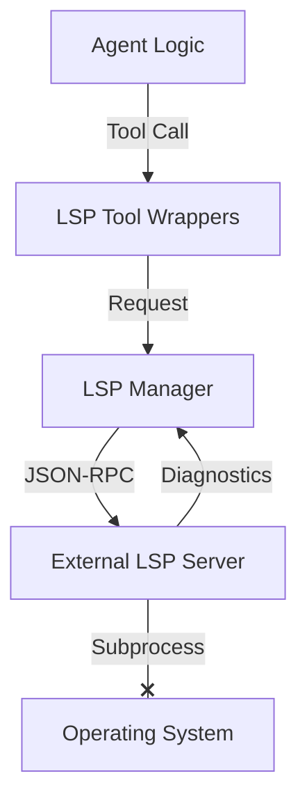

# LSP Integration RFC (Request for Comments)

## 1. 目標 (Goal)

為 Nanobot 增加 LSP (Language Server Protocol) Client 功能，使其能夠連接至標準的語言伺服器（如 `pyright`, `tsserver`, `rust-analyzer`），從而獲得類似 IDE 的代碼理解能力。

**預期效益**:

- **精準導航**: Agent 可以 "Go to Definition", "Find References"。
- **即時診斷**: 在修改程式碼後，Agent 可以立即獲得語法錯誤與類型檢查報告 (Diagnostics)，無需等待執行失敗。
- **智能補全**: (選用) Agent 可以查詢可用屬性與方法，減少幻覺。

## 2. 架構設計 (Architecture)

Nanobot 將扮演 **LSP Client** 的角色。



### 2.1 組件說明

1.  **LSP Client Core (`nanobot/lsp/client.py`)**:
    - 負責啟動 LSP Server 子程序 (stdio)。
    - 封裝 JSON-RPC 通訊協定 (Headers + Content-Length)。
    - 實作基本握手 (`initialize`, `initialized`, `shutdown`).
    - 處理異步訊息 (如 `textDocument/publishDiagnostics`).

2.  **LSP Manager (`nanobot/lsp/manager.py`)**:
    - 管理多個 LSP Server (依據檔案類型 `.py`, `.ts` 分派)。
    - 維護文件狀態 (`textDocument/didOpen`, `didChange`, `didClose`)。
    - **關鍵挑戰**: 必須確保 Agent 修改檔案後，同步通知 LSP Server，否則診斷會過期。

3.  **LSP Tools (`nanobot/agent/tools/lsp.py`)**:
    - 將 LSP 功能暴露為 Agent 可用的工具：
      - `lsp_definition(path, line, character)`
      - `lsp_references(path, line, character)`
      - `lsp_hover(path, line, character)`
      - `lsp_diagnostics(path)` (獲取當前檔案的錯誤)

## 3. 設定方式 (Configuration)

在 `config.json` 中擴充 `tools` 區塊，概念與 `mcpServers` 類似，但專注於語言服務。

```json
{
  "tools": {
    "lsp": {
      "python": {
        "command": "pyright-langserver",
        "args": ["--stdio"],
        "rootUri": "file:///abs/path/to/project"
      },
      "typescript": {
        "command": "typescript-language-server",
        "args": ["--stdio"]
      }
    }
  }
}
```

## 4. 實作路徑 (Implementation Path)

我們有兩個選擇：

### 選項 A: 使用現成 Client Library (推薦)

引入 `multilspy` 或 `sansio-lsp-client`。

- **優點**: 省去實作 JSON-RPC 協議細節。
- **缺點**: 增加依賴。

### 選項 B: 自行實作輕量 Client (目前 MCP 的做法)

參考 MCP 的實作方式，自行處理 Stdio 串流。

- **優點**: 無額外依賴，完全掌控。
- **缺點**: 需處理協議細節 (Content-Length header parsing 等)。

由於 Nanobot 自帶 `mcp` 依賴，而 MCP 本身架構與 LSP 極為相似 (皆為 JSON-RPC over Stdio)，我們或許可以直接複用部分 MCP 的連線邏輯，或者手寫一個極簡的 LSP Client (約 200 行程式碼)。

## 5. 待討論事項 (Questions)

1. **同步問題**: Agent 修改檔案通常是直接寫入磁碟。LSP Server 通常需要 `didChange` 通知。我們是否要在 `write_to_file` 工具中 hook LSP 通知，還是讓 LSP Server 監聽檔案變更 (如果支援)？
   - _建議_: 簡單起見，每次 Agent 讀取檔案前，發送 `didOpen`；寫入後發送 `didSave` (某些 Server 支援 watch，但標準做法是 Client 主動通知)。

2. **範圍**: 是否初期只支援 Python (`pyright` 或 `pylsp`)？

請回饋您的想法，確認後我將開始實作。
